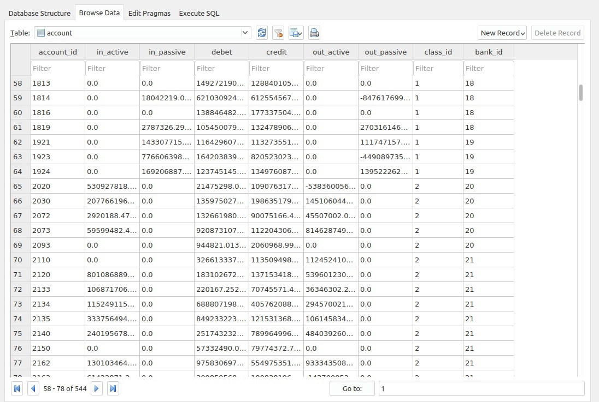
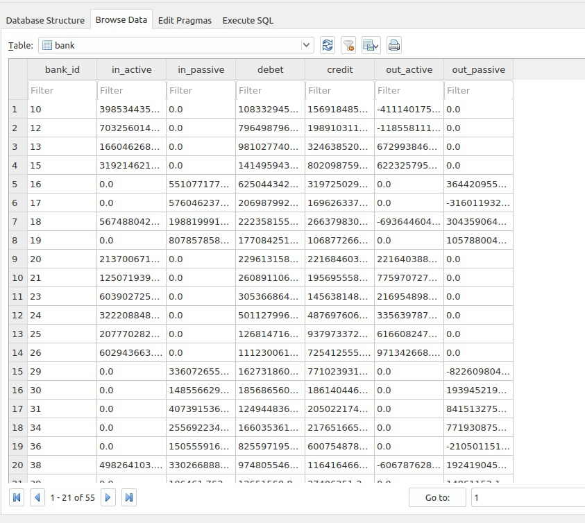

### Привет) Представляю мой проект по имопрту оборотной ведомости из excel в базу данных 'excel_import'

Цель проекта - на основании оборотной ведомости, данной в формате xls, споектировать базу данных, 
настроить процедуру иморта дынных из excel таблицы в нужные таблицы в базе данных. Также необходимо было обернуть данную функциональность в web-интерфейс.

>В качестве субд была выбрана sqlite3
>Язык програмирования - Python3
>Web-framework - Django4
>Дополнительные зависимости находятся в файле requirement.txt

Исходные данные: 'ОСВ для тренинга.xls'

Предварительная работа с исходными данными: файл ОСВ для тренинга.xls был переименован в balance.xls | сконвертироан в balance.xlsx()

Проектирование базы дынных:
---
>1)Были выделеены слудующие информационные обьекты:

* Счет
* Банк 
* Класс 

>2) Были созданы соответствующие таблицы 

* account
* bank
* class

>3)На основании столбцов таблицы данной оборотной ведомости были определены следующие столбцы таблиц бд

* для account - in_active=входящие активы, in_passive=входящие пассивы ,debet=дебет, credit=кредит,
out_active=исходящие активы, out_passive=исходящие пассивы, class_id(внешний ключ ссылается на таблице class), 
bank_id(внешний ключ ссылаается на таблицу bank)
* для bank - in_active=входящие активы, in_passive=входящие пассивы ,debet=дебет, credit=кредит,
out_active=исходящие активы, out_passive=исходящие пассивы, class_id(внешний ключ ссылается на таблице class)
* для class - in_active=входящие активы, in_passive=входящие пассивы ,debet=дебет, credit=кредит,
out_active=исходящие активы, out_passive=исходящие пассивы

Процедура импорта:
---
+ Для извлечения данных из таблицы Excel был использован модуль openpyxl
+ Данные построчно извлекаются в list, затем первый элемент проверятся с помощью регулярных выражений(4 цифры - счет, 2 цифры - банк)
+ Данные записываются в соответствующую таблицу sqlite3
+ При запуске сервера иморт производится при нажатии на кнопку import.
+ Для просмотра содержания получившейся базы данных используется ресурс: https://inloop.github.io/sqlite-viewer

Далее представлен небольшой скринкаст проетка.

### Фрагмент таблицы account

### Фрагмент таблицы bank

### Основной фрагмент скрипта на python
< file_to_read = openpyxl.load_workbook(CUR_DIR + '/excelsql' + '/balance.xlsx', data_only=True)
    sheet = file_to_read['Sheet1']
    # Цикл по строкам начиная с десятой (в первой заголовки)
    for row in range(10, 626):
        # Объявление списка
        data = []
        # Цикл по столбцам от 1 до 4 ( 5 не включая)
        for col in range(1, 8):
            # value содержит значение ячейки с координатами row col
            value = sheet.cell(row, col).value
            # Список который мы потом будем добавлять
            data.append(value)
        if data[1] == None:
            continue
    # 3. Запись в базу и закрытие соединения
        # Вставка данных в поля таблицы
        if re.fullmatch(r'\d\d', str(data[0])):
            cursor.execute("INSERT INTO bank(bank_id, in_active, in_passive, debet, credit, out_active, out_passive) VALUES (?, ?, ?, ?, ?, ?, ?);", (data[0], data[1], data[2], data[3], data[4], data[5], data[6]))
        elif re.fullmatch(r'\d{4}', str(data[0])):
            cursor.execute("INSERT INTO account(account_id, in_active, in_passive, debet, credit, out_active, out_passive, class_id, bank_id) VALUES (?, ?, ?, ?, ?, ?, ?, ?, ?);", (data[0], data[1], data[2], data[3], data[4], data[5], data[6], int(data[0][:1]), int(data[0][:2])))>
